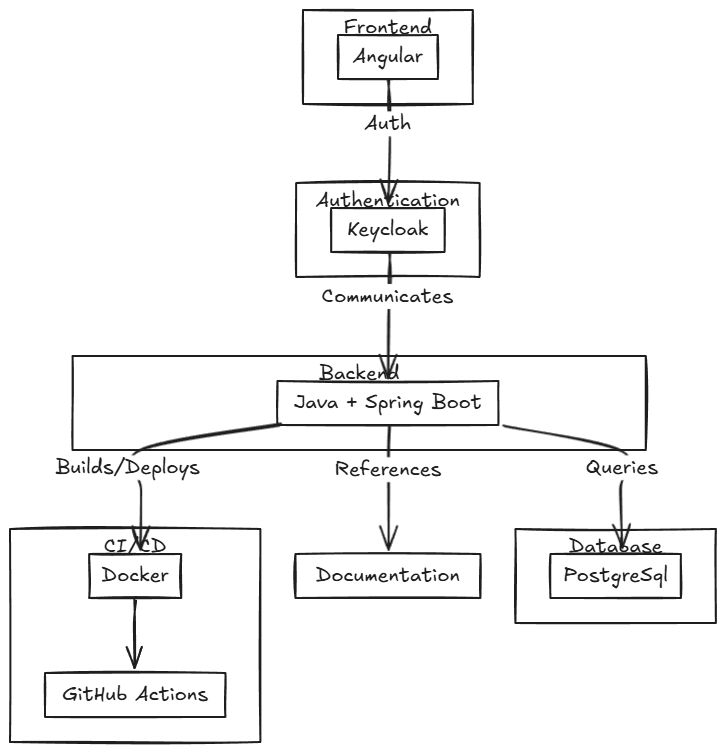

# 📚 Sistema de Acompanhamento de Desempenho Acadêmico

## 🧠 Visão Geral

Este sistema tem como objetivo fornecer às universidades e faculdades uma ferramenta moderna para acompanhar em tempo real a evolução dos alunos, identificar dificuldades por matéria e avaliar o desempenho institucional na formação dos estudantes.

## 👥 Público-Alvo

- Coordenadores de curso
- Professores
- Diretores acadêmicos
- Equipe pedagógica

## 🎯 Problemas Resolvidos

- Falta de visibilidade centralizada do desempenho dos alunos
- Dificuldade em identificar pontos de atenção por matéria
- Dificuldade em demonstrar resultados pedagógicos por período

---

## ✅ Requisitos Funcionais (RF)

| Código | Descrição                                                                 |
|--------|--------------------------------------------------------------------------|
| RF01   | Permitir upload de dados de desempenho (CSV, JSON ou API)               |
| RF02   | Exibir dashboards interativos com gráficos diversos                     |
| RF03   | Filtrar dados por aluno, curso, semestre e matéria                      |
| RF04   | Gerar relatórios exportáveis (PDF, Excel)                               |
| RF05   | Exibir histórico de desempenho por aluno                                |
| RF06   | Permitir login com perfis diferentes (admin, gestor, leitura)           |

---

## 🚫 Requisitos Não Funcionais (RNF)

| Código | Descrição                                                                 |
|--------|--------------------------------------------------------------------------|
| RNF01  | O sistema deve responder requisições em até 500ms (em média)             |
| RNF02  | O acesso ao sistema deve ser protegido por autenticação JWT              |
| RNF03  | O sistema deve ser compatível com navegadores modernos                   |
| RNF04  | Os dados sensíveis devem estar em conformidade com a LGPD                |
| RNF05  | Logs de acesso e alterações devem ser registrados para auditoria         |
| RNF06  | O sistema deve rodar em containers Docker                                |

---

## 👤 Personas

### 🎓 João – Coordenador de Curso
- Deseja identificar rapidamente alunos com desempenho crítico
- Acompanha a evolução geral da turma por matéria

### 👩‍🏫 Ana – Professora
- Quer ver quais tópicos sua turma está com mais dificuldade
- Acompanha individualmente o progresso dos alunos

---

## 🧭 Casos de Uso

### UC01 – Visualizar Dashboard Geral
- O usuário acessa o sistema e vê uma visão geral com gráficos de desempenho

### UC02 – Filtrar por Curso e Semestre
- O usuário seleciona um curso e período letivo para analisar alunos específicos

### UC03 – Gerar Relatório PDF
- O gestor exporta um relatório de desempenho dos alunos com gráficos e tabelas

---

## 🛠️ Stack Tecnológica

| Camada         | Tecnologia                     | Versão       |
|----------------|--------------------------------|--------------|
| Backend        | Java + Spring Boot             | Java 17 / Spring Boot 3.2.x |
| Frontend       | Angular + TypeScript           | Angular 18 / TS 5.x |
| Autenticação   | Keycloak                       | 24.x         |
| Banco de Dados | PostgreSQL                     | 15.x         |
| Infraestrutura | Docker + GitHub Actions        | Docker 24.x  |

---

## 🧱 Diagrama da Stack Tecnológica

## 🔖 MVP – Produto Mínimo Viável

- Upload de dados acadêmicos (.csv)
- Dashboard com gráfico de barras e pizza
- Filtro por matéria e aluno
- Tela de login com autenticação básica

---

## 🛣️ Próximos Passos

1. Modelagem inicial do banco de dados
2. Esqueleto do backend com Spring Boot
3. Esqueleto do frontend com Angular
4. Docker Compose para ambiente local
5. Criação dos endpoints e consumo dos dados mockados

---

> 📌 Esta documentação será atualizada conforme o projeto evolui.
